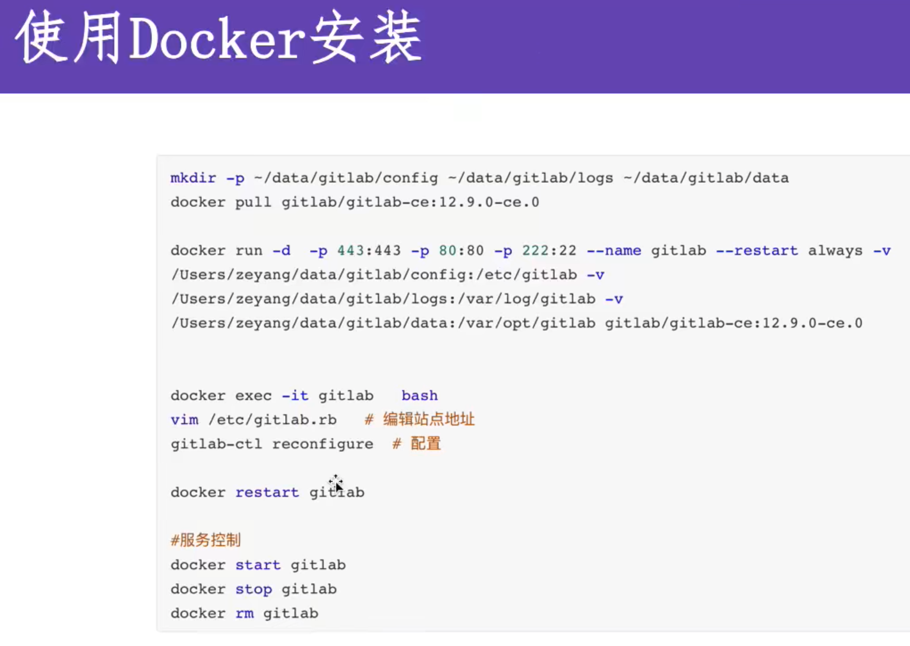

kubernetes安装
docker安装

以下是使用Docker在macOS上安装和配置GitLab的详细中文教程：

### 1. **创建必要的目录:**
首先，创建GitLab所需的配置、日志和数据目录。打开终端，执行以下命令：

   ```bash
   mkdir -p ~/data/gitlab/config ~/data/gitlab/logs ~/data/gitlab/data
   ```

### 2. **拉取GitLab的Docker镜像:**
使用以下命令从Docker仓库拉取指定版本的GitLab镜像：

   ```bash
   docker pull gitlab/gitlab-ce:12.9.0-ce.0
   ```

### 3. **运行GitLab容器:**
使用以下命令启动GitLab容器，并映射所需的端口（将宿主机的端口映射到容器的端口）以及挂载之前创建的目录：

   ```bash
   docker run -d -p 443:443 -p 80:80 -p 222:22 --name gitlab --restart always \
   -v /Users/你的用户名/data/gitlab/config:/etc/gitlab \
   -v /Users/你的用户名/data/gitlab/logs:/var/log/gitlab \
   -v /Users/你的用户名/data/gitlab/data:/var/opt/gitlab \
   gitlab/gitlab-ce:12.9.0-ce.0
   ```

请将`你的用户名`替换为你macOS系统中的实际用户名。

### 4. **访问GitLab容器:**
运行以下命令以进入GitLab容器：

   ```bash
   docker exec -it gitlab bash
   ```

### 5. **编辑GitLab配置文件:**
进入容器后，可以使用`vim`编辑GitLab的配置文件：

   ```bash
   vim /etc/gitlab/gitlab.rb
   ```

在文件中修改配置以满足你的需求。以下是一些常见的配置选项：

#### 设置外部URL：
设置GitLab的外部访问URL，替换为你实际使用的域名或IP地址：

   ```ruby
   external_url 'http://gitlab.example.com'
   ```

#### SMTP邮件配置（可选）：
如果需要GitLab发送邮件通知，可以配置SMTP：

   ```ruby
   gitlab_rails['smtp_enable'] = true
   gitlab_rails['smtp_address'] = "smtp.example.com"
   gitlab_rails['smtp_port'] = 587
   gitlab_rails['smtp_user_name'] = "smtp-user@example.com"
   gitlab_rails['smtp_password'] = "yourpassword"
   gitlab_rails['smtp_domain'] = "example.com"
   gitlab_rails['smtp_authentication'] = "login"
   gitlab_rails['smtp_enable_starttls_auto'] = true
   gitlab_rails['smtp_tls'] = false
   gitlab_rails['smtp_openssl_verify_mode'] = 'peer'
   ```

请将这些占位符替换为你的SMTP服务器信息。

#### 设置GitLab时区：
设置GitLab使用的时区：

   ```ruby
   gitlab_rails['time_zone'] = 'UTC'
   ```

你可以将`'UTC'`替换为你的本地时区，例如 `'Asia/Shanghai'`。

#### 备份设置（可选）：
配置GitLab自动备份的保留时间：

   ```ruby
   gitlab_rails['backup_keep_time'] = 604800   # 保留7天的备份
   ```

这个设置以秒为单位，604800秒即7天。

#### LDAP认证（可选）：
如果你使用LDAP进行用户认证，可以配置如下：

   ```ruby
   gitlab_rails['ldap_enabled'] = true
   gitlab_rails['ldap_servers'] = YAML.load <<-EOS
     main:
       label: 'LDAP'
       host: '_your_ldap_server'
       port: 389
       uid: 'sAMAccountName'
       bind_dn: 'CN=bind user,OU=Users,DC=example,DC=com'
       password: '_your_bind_password'
       encryption: 'plain'  # "start_tls" 或 "simple_tls" 或 "plain"
       verify_certificates: true
       smartcard_auth: false
       active_directory: true
       allow_username_or_email_login: false
       lowercase_usernames: false
       block_auto_created_users: false
       base: 'OU=Users,DC=example,DC=com'
       group_base: ''
       admin_group: ''
       sync_ssh_keys: false
   EOS
   ```

记得将占位符替换为你的LDAP服务器的实际信息。

#### 自定义GitLab设置（可选）：
你还可以配置一些自定义设置，如仓库大小限制，日志路径等：

   ```ruby
   gitlab_rails['gitlab_shell_ssh_port'] = 2222
   gitlab_rails['git_data_dirs'] = {
     "default" => {
       "path" => "/mnt/gitlab-data"
     }
   }
   ```

#### 性能优化（可选）：
对于较大的GitLab部署，可以调整性能相关的参数，例如Puma工作进程和Sidekiq并发性：

   ```ruby
   puma['worker_processes'] = 4
   sidekiq['concurrency'] = 25
   ```

#### 数据库设置（可选）：
如果你使用的是外部数据库，或需要自定义数据库配置，可以进行如下设置：

   ```ruby
   postgresql['enable'] = false
   gitlab_rails['db_adapter'] = "postgresql"
   gitlab_rails['db_encoding'] = "unicode"
   gitlab_rails['db_database'] = "gitlabhq_production"
   gitlab_rails['db_pool'] = 10
   gitlab_rails['db_username'] = "gitlab"
   gitlab_rails['db_password'] = "password"
   gitlab_rails['db_host'] = "db.example.com"
   gitlab_rails['db_port'] = 5432
   ```

替换占位符为你实际的数据库信息。

### 6. **应用配置变更:**
修改完成后，运行以下命令应用配置：

   ```bash
   gitlab-ctl reconfigure
   ```

这个命令会重新配置GitLab，应用你刚才在`gitlab.rb`文件中的所有更改。

### 7. **服务控制命令:**
管理GitLab容器（启动、停止、删除）时使用以下命令：

   ```bash
   docker start gitlab
   docker stop gitlab
   docker rm gitlab
   ```
## Gitlab Runner
Runner是一个开源项目，运行作业并把结果发回gitlab，要和Gitlab版本一致
可以配置任意数量的Runner

作业运行环境，允许自定义，容易安装

三个类型：
shared,整个平台gitlab
group,项目组，特定group下的所有项目
specific， 项目类型，指定项目的作用project

两个状态：
locked, 无法运行项目作业
paused, 暂停，不会运行作业

### docker安装
 ```bash
    docker run --rm -t -id -v ~/data/gitlab-runner/config:/etc/gitlab-runner gitlab/gitlab-runner:v12.9.0
 ```

[//]: # 查找包含gitlab的容器
docker ps | grep gitlab

[//]: # 进入容器的bash命令行，参数为容器id
docker exec -it container_id bash

### GitLab Runner 注册

#### 1. 命令行交互式注册

在终端中执行以下命令注册 GitLab Runner：

```bash
gitlab-runner register
```

系统会依次提示你输入以下信息：

- **Please enter the gitlab-ci coordinator URL (e.g. https://gitlab.com/):**  
  输入 GitLab 实例的 URL，例如 `https://gitlab.com/`。

- **Please enter the gitlab-ci token for this runner:**  
  输入你在项目或组的 Runner 设置中找到的 `runner token`。

- **Please enter the gitlab-ci description for this runner:**  
  为 Runner 输入一个描述名称，便于在 GitLab 中识别。

- **Please enter the gitlab-ci tags for this runner (comma separated):**  
  输入 Runner 的标签，使用逗号分隔。如果没有特定需求，可以留空。

- **Please enter the executor:**  
  选择执行器类型，例如 `docker`、`shell` 等。对于 Docker 执行器，还需要输入默认的 Docker 镜像。

#### 2. 非交互式注册

你可以通过以下命令行参数非交互式地注册 GitLab Runner：

```bash
gitlab-runner register \
  --non-interactive \
  --url "https://gitlab.com/" \
  --registration-token "YOUR_REGISTRATION_TOKEN" \
  --executor "docker" \
  --docker-image "alpine:latest" \
  --description "My Docker Runner" \
  --tag-list "docker,aws" \
  --run-untagged="true" \
  --locked="false" \
  --access-level="not_protected"
```

#### 3. 注册相关命令

- **查看已注册的 Runner：**

  ```bash
  gitlab-runner list
  ```

- **取消注册 Runner：**

  ```bash
  gitlab-runner unregister --name "Runner_Name"
  ```

- **重新注册 Runner：**

  ```bash
  gitlab-runner re-register --name "Runner_Name"
  ```

---

### GitLab CI Pipeline 语法

#### 1. Job

在 `.gitlab-ci.yml` 中可以定义多个 `job`，每个 `job` 至少包含一个 `script`。

示例：

```yaml
job1:
  script:
    - echo "This is job1"
```

#### 2. Script

`script` 定义了在 job 中运行的命令。例如：

```yaml
job1:
  script:
    - echo "Running script in job1"
```

#### 3. before_script & after_script

- **before_script**: 在 `job` 执行之前运行的脚本。

  ```yaml
  before_script:
    - echo "This runs before any job"
  ```

- **after_script**: 在 `job` 执行完成后运行的脚本。

  ```yaml
  after_script:
    - echo "This runs after any job"
  ```

#### 4. Stages

`stages` 定义了 pipeline 的执行阶段。示例：

```yaml
stages:
  - build
  - test
  - deploy
```

#### 5. Stage

每个 `job` 需要指定它所属的 `stage`：

```yaml
build-job:
  stage: build
  script:
    - echo "Building the project"
```

#### 6. Variables

`variables` 可以定义全局或 job 特定的变量：

```yaml
variables:
  PROJECT_NAME: "MyProject"

build-job:
  script:
    - echo "Building $PROJECT_NAME"
```

#### 7. .pre & .post

`.pre` 和 `.post` 是预定义的阶段，在所有 job 之前或之后运行：

```yaml
stages:
  - .pre
  - build
  - test
  - .post
```

#### 8. 并行运行

Runner 默认并行运行的 job 数量是 1，如果需要更改并行数量，可以在 `config.toml` 中修改 `concurrent` 参数：

```toml
concurrent = 4
```

#### 9. Tags

`tags` 用于指定哪些 Runner 可以执行特定的 job：

```yaml
job1:
  tags:
    - docker
```

#### 10. allow_failure

允许 job 失败而不阻塞 pipeline 流程：

```yaml
test-job:
  script:
    - exit 1
  allow_failure: true
```

#### 11. when

控制 job 何时执行：

```yaml
job1:
  script:
    - echo "This job runs on success"
  when: on_success

job2:
  script:
    - echo "This job runs on failure"
  when: on_failure

job3:
  script:
    - echo "This job always runs"
  when: always

job4:
  script:
    - echo "This job runs manually"
  when: manual
```

#### 12. Retry

指定 job 的重试次数和条件：

```yaml
job1:
  script:
    - exit 1
  retry:
    max: 2
    when:
      - runner_system_failure
      - script_failure
```

#### 13. Timeout

设置 job 的超时时间：

```yaml
job1:
  script:
    - sleep 10
  timeout: 2m
```

#### 14. Parallel

设置 job 的并行实例数：

```yaml
job1:
  script:
    - echo "This is running in parallel"
  parallel: 5
```

### 示例脚本

以下是一个完整的 `.gitlab-ci.yml` 示例：

```yaml
stages:
  - build
  - test
  - deploy

variables:
  PROJECT_NAME: "MyProject"

before_script:
  - echo "Preparing environment"

build-job:
  stage: build
  script:
    - echo "Building $PROJECT_NAME"

test-job:
  stage: test
  script:
    - exit 1
  allow_failure: true

deploy-job:
  stage: deploy
  script:
    - echo "Deploying $PROJECT_NAME"
  when: manual

after_script:
  - echo "Cleaning up"
```

这个示例展示了如何定义 `stages`、`variables`、`script`、`allow_failure`、`when` 和 `after_script`。

在 GitLab CI/CD 中，你可以通过 `only`、`except`、`rules` 和 `workflow` 等关键字来控制哪些分支、标签或特定条件下的项目会触发 CI/CD 管道中的某个 job。这些关键字帮助你定义更细粒度的 CI/CD 执行策略。以下是它们的详细解释：

### 1. `only`
`only` 定义了哪些分支或标签会触发某个 job 的执行。常见的用法包括指定特定的分支、标签或 merge requests。

```yaml
job1:
  script:
    - echo "This job runs only on certain branches or tags"
  only:
    - master
    - release/*
    - tags
```

在这个例子中，`job1` 只会在 `master` 分支、所有以 `release/` 开头的分支以及任何标签上运行。

### 2. `except`
`except` 定义了哪些分支或标签不会触发某个 job 的执行。用法类似于 `only`，但逻辑相反。

```yaml
job2:
  script:
    - echo "This job does not run on these branches or tags"
  except:
    - master
    - develop
    - tags
```

在这个例子中，`job2` 不会在 `master`、`develop` 分支以及任何标签上运行。

### 3. `rules`
`rules` 提供了更强大的条件语法，用于在特定条件下执行某个 job。`rules` 可以结合 `if`、`changes`、`allow_failure` 等条件。

#### 3.1 `rules: if`
`rules: if` 根据表达式的结果来决定是否执行某个 job。

```yaml
job3:
  script:
    - echo "This job runs if the branch is master"
  rules:
    - if: '$CI_COMMIT_BRANCH == "master"'
```

在这个例子中，`job3` 只有在当前分支是 `master` 时才会运行。

#### 3.2 `rules: changes`
`rules: changes` 定义了当特定文件或目录发生更改时，才会执行某个 job。

```yaml
job4:
  script:
    - echo "This job runs if files in the src/ directory are changed"
  rules:
    - changes:
        - src/*
```

在这个例子中，如果 `src/` 目录中的文件发生更改，`job4` 就会被触发。

#### 3.3 `rules: allow_failure`
`rules: allow_failure` 允许在特定条件下，如果某个 job 失败，管道仍然可以继续执行。

```yaml
job5:
  script:
    - echo "This job is allowed to fail"
  rules:
    - if: '$CI_COMMIT_BRANCH == "feature-branch"'
      allow_failure: true
```

在这个例子中，`job5` 在 `feature-branch` 上运行时，如果失败，管道不会因为这个 job 的失败而中止。

### 4. `workflow`
`workflow` 定义了整个 pipeline 何时被创建或执行。它可以用 `rules` 来定义创建 pipeline 的条件。

```yaml
workflow:
  rules:
    - if: '$CI_COMMIT_BRANCH == "master"'
    - if: '$CI_PIPELINE_SOURCE == "merge_request_event"'
```

在这个例子中，pipeline 只会在 `master` 分支或 merge request 事件触发时被创建。

### 总结

- **`only`**：定义哪些分支、标签、或事件会触发 job 的执行。
- **`except`**：定义哪些分支、标签、或事件不会触发 job 的执行。
- **`rules`**：提供更复杂的条件逻辑来控制 job 是否执行，可以使用 `if`、`changes`、`allow_failure` 等条件。
- **`workflow`**：控制整个 pipeline 的执行条件。

通过合理使用这些关键字，你可以更灵活地控制 GitLab CI/CD 管道的执行逻辑，确保在适当的条件下运行适当的任务。

### Cache 在 GitLab CI/CD 中的使用

在 GitLab CI/CD 中，`cache` 用于在 job 之间共享和重用文件或目录，以加快 pipeline 的执行速度。通常，这些缓存文件包括编译项目所需的依赖项、构建产物或其他运行时资源。

### 1. `cache` 基本语法

#### 全局 `cache`
你可以在 `.gitlab-ci.yml` 文件的顶部定义一个全局 `cache`，它适用于所有的 job。

```yaml
cache:
  key: default
  paths:
    - .m2/repository/
    - node_modules/
```

在这个例子中，所有 job 都会缓存 Maven 的本地存储库和 Node.js 的 `node_modules` 目录。

#### Job 特定的 `cache`
你可以在特定的 job 中定义 `cache`，它会覆盖全局的 `cache` 设置。

```yaml
job1:
  script:
    - mvn install
  cache:
    key: maven-cache
    paths:
      - .m2/repository/

job2:
  script:
    - npm install
  cache:
    key: node-cache
    paths:
      - node_modules/
```

在这个例子中，`job1` 只会缓存 Maven 存储库，而 `job2` 只会缓存 Node.js 的依赖。

### 2. `cache: key` 缓存标记

`cache: key` 用于标识缓存文件的唯一性。可以使用不同的 `key` 来为不同的 job、分支、或条件创建独立的缓存。

- **默认 key**: 如果不指定 `key`，默认使用 `default`。

```yaml
cache:
  key: $CI_COMMIT_REF_NAME
  paths:
    - target/
```

在这个例子中，每个分支都有自己的缓存，因为 `key` 使用了 `$CI_COMMIT_REF_NAME` 变量（当前分支名）。

#### `cache:key:files`

使用 `key:files` 来基于文件的内容创建缓存 key。这意味着如果文件的内容发生变化，缓存也会相应地更新。

```yaml
cache:
  key:
    files:
      - package-lock.json
      - yarn.lock
  paths:
    - node_modules/
```

在这个例子中，缓存 key 基于 `package-lock.json` 和 `yarn.lock` 文件的内容。如果其中任何一个文件发生变化，缓存就会更新。

#### `cache:key:paths`

你可以使用 `key:paths` 来基于目录或文件路径创建缓存 key。这对于缓存不同路径的数据很有用。

### 3. `cache: policy` 缓存策略

- **默认策略**: 默认情况下，`cache` 会在 job 开始时下载缓存，并在 job 结束时上传缓存。

```yaml
cache:
  paths:
    - node_modules/
  policy: pull-push
```

- **`policy: pull`**: 只下载缓存，而不上传。

```yaml
cache:
  paths:
    - node_modules/
  policy: pull
```

在这个例子中，job 会从缓存中下载文件，但不会在 job 结束后更新缓存。

- **`policy: push`**: 只上传缓存，而不下载。

```yaml
cache:
  paths:
    - node_modules/
  policy: push
```

在这个例子中，job 不会使用已有的缓存，但会在 job 结束后上传新的缓存。

### 4. 带缓存的 Pipeline 工作流程

带缓存的 GitLab CI/CD pipeline 通常按照以下步骤工作：

1. **定义缓存**：你可以在 `.gitlab-ci.yml` 中为整个 pipeline 或特定的 job 定义 `cache`。
2. **缓存下载（pull）**：在 job 开始执行时，GitLab Runner 会自动下载缓存中定义的文件或目录。
3. **执行 job**：缓存的文件或目录被用于 job 的执行，例如构建或测试过程。
4. **缓存上传（push）**：在 job 执行结束后，GitLab Runner 会将更新后的文件或目录重新上传到缓存中。

### 示例：带缓存的 CI 工作流程

```yaml
stages:
  - build
  - test

cache:
  key: $CI_COMMIT_REF_SLUG
  paths:
    - node_modules/

build-job:
  stage: build
  script:
    - npm install
  cache:
    policy: pull-push

test-job:
  stage: test
  script:
    - npm test
  cache:
    policy: pull
```

在这个示例中：

- `build-job` 会在开始时下载缓存中的 `node_modules/`，然后执行 `npm install`，并在结束时重新上传 `node_modules/` 到缓存中。
- `test-job` 只会下载 `node_modules/`，而不会重新上传缓存。


在 GitLab CI/CD 中，`artifacts` 用于指定在 job 执行完成后需要保存的文件或目录。这些文件可以是构建产物、测试报告、日志等。`artifacts` 可以帮助你在不同的 job 之间共享数据，也可以用于在 pipeline 执行完成后下载或查看这些数据。

### 1. `artifacts`

`artifacts` 指定哪些文件或目录需要在 job 执行后保存，并提供多个配置选项来控制这些文件的保存方式和访问方式。

```yaml
job1:
  script:
    - make build
  artifacts:
    paths:
      - binaries/
    expire_in: 1 week
```

在这个例子中，`binaries/` 目录中的所有文件会作为 `artifacts` 保存，并在 1 周后自动删除。

### 2. `artifacts: expose_as`

`expose_as` 允许你为 `artifacts` 指定一个显示名称，方便在 GitLab UI 中标识和查看这些 `artifacts`。

```yaml
job1:
  script:
    - make build
  artifacts:
    paths:
      - binaries/
    expose_as: "Build Artifacts"
```

在这个例子中，`binaries/` 目录将以“Build Artifacts”的名称显示在 GitLab 的 UI 中。

### 3. `artifacts: name`

`name` 允许你为 `artifacts` 指定一个自定义的文件名。默认情况下，`artifacts` 会使用 `job` 名称作为文件名。

```yaml
job1:
  script:
    - make build
  artifacts:
    name: "my-build-artifacts"
    paths:
      - binaries/
```

在这个例子中，`artifacts` 会被保存为 `my-build-artifacts.zip` 文件。

### 4. `artifacts: when`

`when` 指定在什么情况下保存 `artifacts`。可以使用以下几种策略：

- **`on_success`**（默认）：在 job 成功完成后保存 `artifacts`。
- **`on_failure`**：在 job 失败时保存 `artifacts`。
- **`always`**：无论 job 成功与否，始终保存 `artifacts`。

```yaml
job1:
  script:
    - make build
  artifacts:
    paths:
      - binaries/
    when: on_failure
```

在这个例子中，`binaries/` 目录只会在 job 失败时保存。

### 5. `artifacts: expire_in`

`expire_in` 指定 `artifacts` 在多长时间后过期并自动删除。你可以使用人类可读的时间格式，如 `1 week`、`2 days`、`3 months` 等。

```yaml
job1:
  script:
    - make build
  artifacts:
    paths:
      - binaries/
    expire_in: 1 week
```

在这个例子中，`binaries/` 目录中的文件会在 1 周后过期并被删除。

### 6. `artifacts: reports`

`reports` 选项用于保存特定类型的报告文件，如代码覆盖率报告或测试结果。GitLab 会根据这些报告提供专门的 UI 展示。

#### `artifacts: reports:cobertura`

用于保存 Cobertura 格式的代码覆盖率报告。

```yaml
job1:
  script:
    - make test
  artifacts:
    reports:
      cobertura: coverage.xml
```

在这个例子中，`coverage.xml` 文件会作为 Cobertura 格式的代码覆盖率报告保存，GitLab 会在 UI 中显示代码覆盖率信息。

#### `artifacts: reports:junit`

用于保存 JUnit 格式的测试报告。

```yaml
job1:
  script:
    - make test
  artifacts:
    reports:
      junit: test-results.xml
```

在这个例子中，`test-results.xml` 文件会作为 JUnit 格式的测试报告保存，GitLab 会在 UI 中显示测试结果。

### 7. `dependencies`

`dependencies` 允许你指定当前 job 依赖于哪些前置 job 的 `artifacts`。默认情况下，GitLab 会自动识别并下载所有上一个 `stage` 的 `artifacts`。通过 `dependencies`，你可以精确指定只下载哪些 job 的 `artifacts`，从而优化性能。

```yaml
build-job:
  stage: build
  script:
    - make build
  artifacts:
    paths:
      - binaries/

test-job:
  stage: test
  script:
    - make test
  dependencies:
    - build-job
```

在这个例子中，`test-job` 依赖于 `build-job` 的 `artifacts`，即 `binaries/` 目录中的文件会被下载到 `test-job` 中使用。

通过这些 `artifacts` 和 `dependencies` 的设置，你可以精确控制 job 之间的数据共享和保存策略，提高 GitLab CI/CD pipeline 的效率和可视化效果。

在 GitLab CI/CD 中，`needs` 关键字允许你指定某个 job 依赖于其他 job 的执行结果，而不必按照传统的 `stages` 顺序执行。这意味着你可以创建并行的 job 或让不同阶段的 job 同时执行，从而加快整个 pipeline 的执行速度。

### `needs` 关键字的作用

- **并行执行阶段**：默认情况下，GitLab CI/CD 会按照 `stages` 的顺序来执行 job，这意味着每个阶段的所有 job 都完成后，才会开始下一个阶段的 job。通过 `needs`，你可以指定某个 job 需要依赖哪些其他 job，然后直接并行执行它们，而不是等待所有前面的阶段完成。

- **无序执行作业**：使用 `needs` 可以打破 `stages` 顺序的限制，允许某些 job 在其所需的前置 job 完成后立即执行，而不必等到它们所属的阶段。

### 示例

以下是一个使用 `needs` 关键字的 `.gitlab-ci.yml` 示例：

```yaml
stages:
  - build
  - test
  - deploy

build-job:
  stage: build
  script:
    - echo "Building the project"
  artifacts:
    paths:
      - build/

test-job:
  stage: test
  script:
    - echo "Running tests"
  needs:
    - job: build-job
  dependencies:
    - build-job

deploy-job:
  stage: deploy
  script:
    - echo "Deploying the project"
  needs:
    - job: test-job
```

### 解读示例

- **`build-job`**：位于 `build` 阶段，按正常顺序执行，生成 `build/` 目录中的产物。

- **`test-job`**：位于 `test` 阶段，依赖于 `build-job` 的产物。由于使用了 `needs`，`test-job` 会在 `build-job` 完成后立即执行，而不需要等待其他 `test` 阶段的 job 或之前所有 `build` 阶段的 job 完成。

- **`deploy-job`**：位于 `deploy` 阶段，依赖于 `test-job` 的执行结果。同样，因为使用了 `needs`，`deploy-job` 可以在 `test-job` 完成后立即执行，而不需要等待 `test` 阶段的其他 job 或所有 `test` 阶段的 job 完成。

### 优势

- **加快 Pipeline 执行速度**：通过允许 job 并行执行和打破 `stages` 顺序，`needs` 可以显著减少 pipeline 的总执行时间。

- **灵活的执行顺序**：你可以根据实际需求指定 job 之间的依赖关系，而不是严格按照 `stages` 顺序，提供更大的灵活性。

### 注意事项

- **合理使用 `needs`**：在设计 pipeline 时，确保正确理解 job 之间的依赖关系，避免因不必要的并行执行导致资源竞争或意外的执行顺序。

- **并行限制**：虽然 `needs` 可以并行执行 job，但仍需考虑 GitLab Runner 的并行执行能力（即同时执行 job 的最大数量）。

通过使用 `needs`，你可以更有效地组织和优化 CI/CD pipeline，特别是在需要快速反馈或复杂依赖的情况下。

在 GitLab CI/CD 中，`include` 和 `extends` 关键字可以帮助你组织和复用 `.gitlab-ci.yml` 文件中的配置，尤其是在管理复杂的 pipeline 时非常有用。

### 1. `include`

`include` 关键字允许你将外部的 YAML 配置文件引入到你的 `.gitlab-ci.yml` 文件中。这对于大型项目或多团队协作非常有用，因为它可以将不同的配置部分拆分成独立的文件并集中管理。

#### 1.1 `include: local`

`include: local` 用于引入同一存储库中的文件。你需要使用相对于存储库根目录的路径来引用这些文件。

```yaml
include:
  - local: 'ci-templates/build.yml'
  - local: 'ci-templates/test.yml'
```

在这个例子中，`build.yml` 和 `test.yml` 两个文件会被引入到主 `.gitlab-ci.yml` 文件中，它们位于存储库的 `ci-templates/` 目录中。

#### 1.2 `include: remote`

`include: remote` 用于引入托管在外部服务器上的配置文件。你需要指定文件的完整 URL。

```yaml
include:
  - remote: 'https://example.com/path/to/ci-template.yml'
```

在这个例子中，GitLab 会从指定的 URL 下载并引入 `ci-template.yml` 文件中的配置。

#### 1.3 `include: template`

`include: template` 用于引入 GitLab 提供的预定义模板，这些模板通常用于常见的 CI/CD 任务，如构建、测试和部署。

```yaml
include:
  - template: 'Jobs/Build.gitlab-ci.yml'
  - template: 'Security/SAST.gitlab-ci.yml'
```

在这个例子中，引入了 GitLab 官方提供的构建和安全扫描模板。

### 2. `extends`

`extends` 关键字允许你继承和复用其他 job 的配置。这可以避免重复定义相同的配置内容，并提高 `.gitlab-ci.yml` 文件的可维护性。

#### 2.1 基本用法

你可以在某个 job 中使用 `extends` 来继承另一个 job 的所有配置。

```yaml
.default-job:
  script:
    - echo "This is the default job script"
  tags:
    - docker

build-job:
  extends: .default-job
  script:
    - echo "Building the project"

test-job:
  extends: .default-job
  script:
    - echo "Running tests"
```

在这个例子中，`build-job` 和 `test-job` 都继承了 `.default-job` 的配置，因此它们共享相同的 `tags` 和基础 `script`。但每个 job 也可以添加或覆盖部分配置，例如 `script`。

#### 2.2 多重继承

你可以从多个 job 或模板继承配置，GitLab 会按顺序应用这些配置。

```yaml
.base-job:
  tags:
    - docker
  script:
    - echo "This is the base job"

.custom-job:
  variables:
    ENV: production

build-job:
  extends:
    - .base-job
    - .custom-job
  script:
    - echo "Building the project with $ENV environment"
```

在这个例子中，`build-job` 继承了 `.base-job` 和 `.custom-job` 的配置，因此它既有 `tags` 和基础 `script`，也有来自 `.custom-job` 的环境变量 `ENV`。

### 综合示例

结合 `include` 和 `extends`，你可以构建一个强大的、模块化的 CI/CD 配置：

```yaml
include:
  - local: 'ci-templates/common.yml'
  - remote: 'https://example.com/path/to/deploy-template.yml'

.base-job:
  script:
    - echo "This is a shared script"
  tags:
    - docker

build-job:
  extends: .base-job
  script:
    - echo "Building the project"
  needs:
    - job: build-dependencies

test-job:
  extends: .base-job
  script:
    - echo "Running tests"
```

- **`include`**：引入了本地和远程的配置文件，用于共享和复用公共配置。
- **`extends`**：多个 job 继承了 `base-job` 的配置，减少了代码重复。

通过使用 `include` 和 `extends`，你可以将 GitLab CI/CD 配置模块化、复用化，从而使管理复杂的 pipeline 变得更加简洁和高效。

trigger
多项目管道：上游管道完成触发下游管道
parent-child管道
子管道child-a-build
parent管道include


### 1. **Image (镜像的作用，设置)**
- **作用 (Purpose):** 在CI/CD流水线中，`image`关键字用于指定将用于作业执行的Docker镜像。这个镜像提供了一致的环境，确保在流水线的不同阶段中使用相同的基础环境。
- **设置 (Setup):** 在注册runner时（特别是使用Docker执行器时），通常需要定义一个基础镜像。例如：
  ```yaml
  image: node:14
  ```
  这将runner设置为默认使用Node.js 14环境来执行流水线中的任何作业。

### 2. **Services (服务)**
- **作用 (Purpose):** `services`关键字用于定义应该与主容器一起运行的其他Docker容器。这些容器通常用于依赖服务，如数据库、缓存服务器等，在流水线运行期间，您的代码可能需要与这些服务进行交互。
- **示例:**
  ```yaml
  services:
    - postgres:latest
  ```
  在这个示例中，将启动一个PostgreSQL容器，并将其链接到您的主容器，从而使您的代码在作业执行期间能够与一个实时的数据库进行交互。

### 3. **Environments (环境管理)**
- **作用 (Purpose):** `environments`关键字用于定义和管理不同的部署环境。通过配置环境，您可以控制代码在不同阶段的部署位置以及如何在这些环境之间进行过渡。
- **示例:**
  ```yaml
  environment:
    name: production
    url: https://your-app.com
  ```
  这将定义一个名为“production”的环境，并将部署URL设置为指定的地址。

### 4. **Inherit (继承)**
- **作用 (Purpose):** `inherit`关键字用于控制作业是否继承全局定义的变量、脚本或其他配置。它允许您在某些作业中覆盖或跳过全局设置，以满足特定的需求。
- **示例:**
  ```yaml
  inherit:
    variables: false
  ```
  这将使当前作业不继承全局定义的变量设置。

下面是一个完整的GitLab CI/CD YAML文件示例，它涵盖了`image`、`services`、`environments`、和`inherit`等关键字的使用：

```yaml
# 定义全局的image
image: node:14

# 定义全局变量
variables:
  NODE_ENV: production
  TEST_VAR: default_value

# 定义stages（阶段）
stages:
  - build
  - test
  - deploy

# 定义build阶段的作业
build_job:
  stage: build
  script:
    - npm install
    - npm run build
  artifacts:
    paths:
      - dist/

# 定义test阶段的作业
test_job:
  stage: test
  image: node:14
  services:
    - postgres:latest
  script:
    - npm run test
  variables:
    NODE_ENV: test
  environment:
    name: testing
    url: https://testing.example.com

# 覆盖全局变量并继承部分配置的作业
override_job:
  stage: test
  inherit:
    variables: false
  script:
    - echo "This job does not inherit global variables"
    - echo "TEST_VAR is $TEST_VAR"

# 定义deploy阶段的作业
deploy_job:
  stage: deploy
  script:
    - echo "Deploying to production"
  environment:
    name: production
    url: https://your-app.com
```

### 解释：

1. **image**:
  - 在全局范围内定义了一个基础镜像`node:14`，所有没有指定镜像的作业都将使用该镜像。

2. **variables**:
  - 定义了全局变量`NODE_ENV`和`TEST_VAR`，这些变量将在所有作业中可用，除非在特定作业中覆盖。

3. **stages**:
  - 定义了流水线的三个阶段：`build`、`test` 和 `deploy`。

4. **build_job**:
  - 使用全局的`node:14`镜像，运行`npm install`和`npm run build`来构建项目，构建产物会被保存在`dist/`目录中。

5. **test_job**:
  - 在`test`阶段中定义的作业，指定了`postgres:latest`作为服务，使其在测试期间可用。还定义了`NODE_ENV`的测试环境变量，并且配置了`testing`环境的名称和URL。

6. **override_job**:
  - 这个作业使用了`inherit`关键字，禁用了全局变量的继承，明确指出`TEST_VAR`不会继承全局的值，而是使用默认的空值或局部定义的值。

7. **deploy_job**:
  - 部署阶段的作业，将代码部署到`production`环境，并指定了生产环境的URL。


模板库规划
为了帮助您规划一个CI模板库，并集成Maven和npm构建工具，以下是一个分步骤的指南和示例配置。这个指南包括如何创建CI模板库、Maven和npm的构建集成、环境配置、虚拟机设置、以及如何创建build作业和管道流水线的模板。

### 1. **模板库规划**
- **目标:** 创建一个CI模板库，包含常用的构建、测试和部署流程的模板。
- **目录结构示例:**
  ```
  ci-templates/
  ├── maven/
  │   ├── maven-build-template.yml
  │   ├── maven-pipeline-template.yml
  ├── npm/
  │   ├── npm-build-template.yml
  │   ├── npm-pipeline-template.yml
  └── README.md
  ```

### 2. **创建CI模板库**
- **目的:** 让团队可以共享和复用CI配置，减少重复配置的工作。
- **步骤:**
  1. 在GitLab或其他版本控制系统中创建一个新的项目，比如`ci-templates`。
  2. 根据不同的工具和需求，在项目中创建不同的目录，如`maven`和`npm`。
  3. 在每个目录下，添加相关的CI模板文件。

### 3. **Maven构建工具集成步骤**
- **Maven基础配置:**
  1. 创建Maven的全局环境变量，比如`M2_HOME`和`PATH`。
  2. 设置`settings.xml`文件来配置Maven仓库、代理和其他自定义设置。

- **虚拟机上安装Maven步骤:**
  1. 下载Maven：
     ```sh
     wget http://mirror.olnevhost.net/pub/apache/maven/maven-3/3.8.5/binaries/apache-maven-3.8.5-bin.tar.gz
     ```
  2. 解压并移动到合适的目录：
     ```sh
     tar xzvf apache-maven-3.8.5-bin.tar.gz
     sudo mv apache-maven-3.8.5 /usr/local/apache-maven
     ```
  3. 配置环境变量：
     ```sh
     export M2_HOME=/usr/local/apache-maven
     export PATH=$M2_HOME/bin:$PATH
     ```
  4. 验证安装：
     ```sh
     mvn -version
     ```

- **创建Maven构建作业模板:**
  ```yaml
  # ci-templates/maven/maven-build-template.yml
  image: maven:3.8.5-jdk-11

  variables:
    MAVEN_CLI_OPTS: "-s settings.xml --batch-mode"
    MAVEN_OPTS: "-Xmx1024m"

  build_job:
    script:
      - mvn $MAVEN_CLI_OPTS clean package
  ```

- **创建Maven管道流水线模板:**
  ```yaml
  # ci-templates/maven/maven-pipeline-template.yml
  stages:
    - build
    - test
    - deploy

  include:
    - local: 'maven/maven-build-template.yml'

  test_job:
    stage: test
    script:
      - mvn $MAVEN_CLI_OPTS test

  deploy_job:
    stage: deploy
    script:
      - mvn $MAVEN_CLI_OPTS deploy
  ```

### 4. **npm构建工具集成步骤**
- **npm基础配置:**
  1. 设置`.npmrc`文件来配置npm仓库、代理和其他自定义设置。
  2. 安装npm依赖：
     ```sh
     npm install
     ```

- **创建npm构建作业模板:**
  ```yaml
  # ci-templates/npm/npm-build-template.yml
  image: node:14

  variables:
    CI: "true"

  build_job:
    script:
      - npm install
      - npm run build
  ```

- **创建npm管道流水线模板:**
  ```yaml
  # ci-templates/npm/npm-pipeline-template.yml
  stages:
    - build
    - test
    - deploy

  include:
    - local: 'npm/npm-build-template.yml'

  test_job:
    stage: test
    script:
      - npm run test

  deploy_job:
    stage: deploy
    script:
      - npm run deploy
  ```

### 5. **继承并添加test job**
- **继承配置示例:**
  如果你有多个项目想要复用模板库中的配置，可以使用`include`关键字来继承模板，并在具体的项目中扩展或覆盖模板中的配置。

- **项目中的.gitlab-ci.yml文件示例:**
  ```yaml
  include:
    - project: 'ci-templates'
      file: '/maven/maven-pipeline-template.yml'

  # 添加项目特定的test job
  additional_test_job:
    stage: test
    script:
      - mvn $MAVEN_CLI_OPTS verify
  ```

通过以上步骤和模板，您可以创建一个强大的CI模板库，能够在不同的项目中轻松复用，并根据项目的需要进行扩展和自定义。这种方式不仅节省时间，还确保了配置的一致性和可维护性。


在CI/CD流水线中添加单元测试是确保代码质量的重要步骤。以下是如何将单元测试集成到您的Maven和npm构建过程中，并将其配置到您的CI模板中的示例。

### 1. **Maven单元测试集成**

Maven通常使用JUnit或TestNG来进行单元测试。在Maven项目中，单元测试通常位于`src/test/java`目录下，并在`mvn test`命令执行时自动运行。

#### **Maven单元测试作业模板**

```yaml
# ci-templates/maven/maven-test-template.yml
image: maven:3.8.5-jdk-11

variables:
  MAVEN_CLI_OPTS: "-s settings.xml --batch-mode"
  MAVEN_OPTS: "-Xmx1024m"

test_job:
  stage: test
  script:
    - mvn $MAVEN_CLI_OPTS test
  artifacts:
    when: always
    reports:
      junit: target/surefire-reports/TEST-*.xml
    paths:
      - target/surefire-reports/
```

#### **说明**:
- **`mvn test`**: 执行Maven的测试目标，运行所有位于`src/test/java`下的单元测试。
- **`artifacts`**: 将测试报告保存为流水线的产物，并在每次运行后收集这些报告以便于查看。
- **`junit`**: 生成JUnit格式的报告，使GitLab可以在CI/CD界面中展示测试结果。

### 2. **npm单元测试集成**

在npm项目中，通常使用Jest、Mocha、Jasmine等测试框架进行单元测试，测试文件通常放在`tests`或`__tests__`目录下。

#### **npm单元测试作业模板**

```yaml
# ci-templates/npm/npm-test-template.yml
image: node:14

variables:
  CI: "true"

test_job:
  stage: test
  script:
    - npm install
    - npm test
  artifacts:
    when: always
    reports:
      junit: test-results.xml
    paths:
      - test-results.xml
```

#### **说明**:
- **`npm test`**: 运行`package.json`中定义的测试脚本，通常配置为执行所有单元测试。
- **`artifacts`**: 将测试报告保存为流水线的产物，并将测试结果以JUnit格式输出，以便于GitLab CI进行展示。

### 3. **更新管道流水线模板以包含单元测试**

将单元测试模板添加到管道流水线模板中，以确保每次构建都会自动运行单元测试。

#### **Maven管道流水线模板**

```yaml
# ci-templates/maven/maven-pipeline-template.yml
stages:
  - build
  - test
  - deploy

include:
  - local: 'maven/maven-build-template.yml'
  - local: 'maven/maven-test-template.yml'

deploy_job:
  stage: deploy
  script:
    - mvn $MAVEN_CLI_OPTS deploy
```

#### **npm管道流水线模板**

```yaml
# ci-templates/npm/npm-pipeline-template.yml
stages:
  - build
  - test
  - deploy

include:
  - local: 'npm/npm-build-template.yml'
  - local: 'npm/npm-test-template.yml'

deploy_job:
  stage: deploy
  script:
    - npm run deploy
```

### 4. **继承并扩展测试作业**

在项目中可以进一步继承这些模板，并根据需要添加额外的测试作业。

#### **项目中的.gitlab-ci.yml文件示例**

```yaml
include:
  - project: 'ci-templates'
    file: '/maven/maven-pipeline-template.yml'

# 添加项目特定的test job
additional_test_job:
  stage: test
  script:
    - mvn $MAVEN_CLI_OPTS verify
  artifacts:
    when: always
    reports:
      junit: target/failsafe-reports/TEST-*.xml
    paths:
      - target/failsafe-reports/
```

通过将单元测试集成到您的CI/CD流水线中，您可以在每次代码提交或合并时自动进行测试，确保代码的质量和稳定性。以上模板也为团队的标准化和自动化工作流程提供了有力支持。


