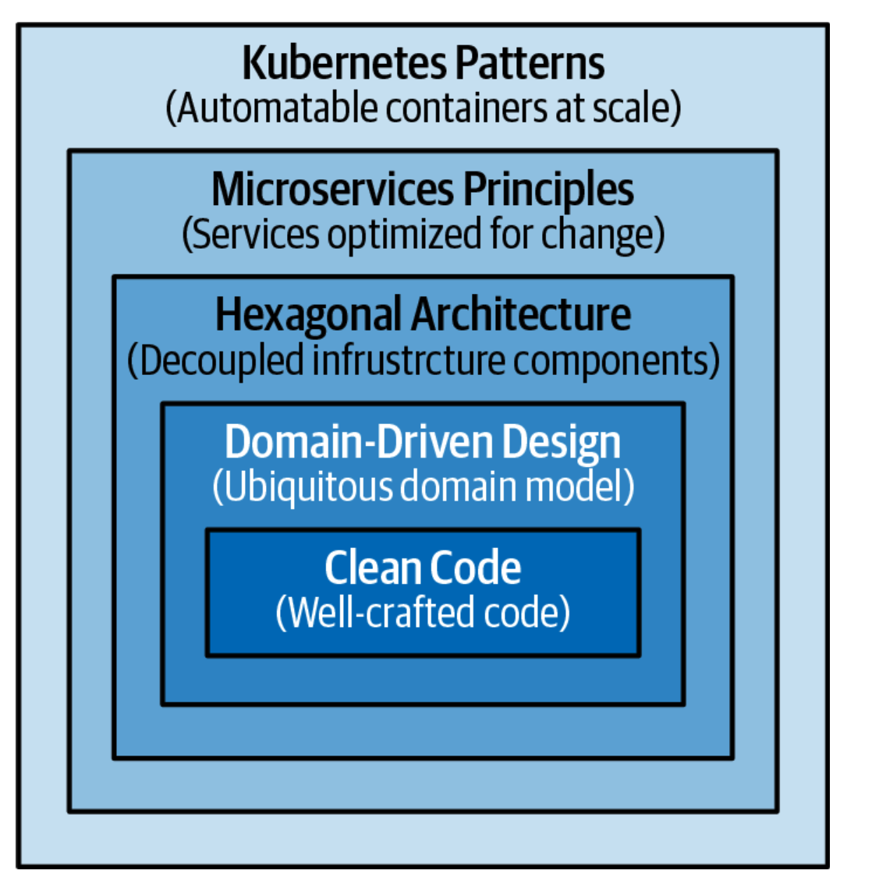

>这一章介绍后续设计和实现云原生应用中用到kubernetes核心概念。

## The Path to Cloud Native
在云原生应用中，微服务是最流行的架构风格。通过模块化，将开发过程的复杂性转移到了运维过程的复杂性，所以微服务能够成功的前提条件就说可以通过Kubernetes实现规模化运行。在微服务化的过程中，有很多理论、技术、工具将单体架构转换为微服务，大多数都是Domain-Driven Design和bounded contexts and aggregates.但是除了这些业务领域的考虑之外，对于每个分布式系统(无论它是否基于微服务) ，还有关于其外部结构和运行时耦合的技术考虑。像Kubernetes这样的工具可以解决分布式系统的这些问题。容器和容器管理平台有很多好处，但是放进容器的内容也很重要，如果你放进去的都是垃圾，那你只会得到一个分布式的垃圾。图2是创建一个好的云原生应用所需要的技能以及Kubernetes pattern所处的位置。

最核心的code level，努力编写干净代码、拥有适当数量的自动化测试、不断地重构以提高代码质量。

Domain-driven design， 从业务的角度来处理软件设计，目的是使架构尽可能接近真实世界。具有正确的业务和事务边界、易于使用的接口和丰富的 API 模型是后续容器化化和自动化成功的基础。

The hexagonal architecture and its variations,通过解耦应用程序组件并提供与它们交互的标准化接口，提高应用程序的灵活性和可维护性。通过将系统的核心业务逻辑与周围的基础设施分离，hexagonal architecture使得将系统移植到不同的环境或平台变得更加容易。

The microservices architectural style and the twelve-factor app
methodology迅速发展成为创建分布式应用程序的规范，它们为设计不断变化的分布式应用程序提供了有价值的原则和实践。

Containers被用作打包和运行分布式应用程序的标准方法，无论这些应用程序是微服务还是功能。创建模块化的、可重用的、良好的containers是另一个基本的先决条件。

在这本书中我们只关注patterns and practices addressing the concerns of the container
orchestration，也就是最外层。

## Containers
container image是解决单个问题的功能单元。
一个container image由一个团队拥有，并且有自己的发布周期。
container image是自包含的，定义并携带其运行时依赖项。
container image是不可变的，一旦构建了它，它就不会改变; 它是配置好的。
container image定义resource requirements和external dependencies。
container image通过定义良好的 API 来暴露功能。
container通常作为单个 Unix 进程运行。
container是disposable的，可以随时safe to scale up or down。

## Pods

P28

P38
P55
P68

P79
P89
P107

