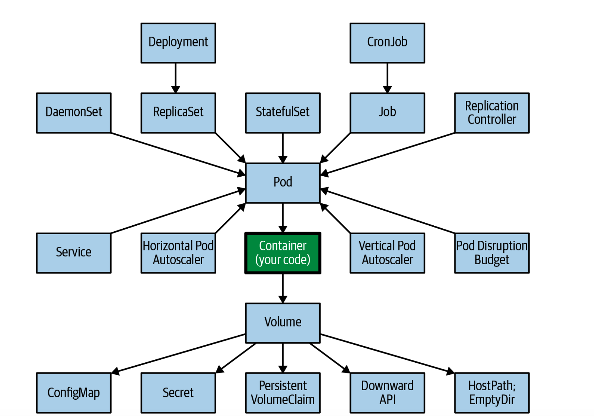

>这一章介绍后续设计和实现云原生应用中用到kubernetes核心概念。

### 云原生应用设计与 Kubernetes 核心概念

---

#### 📌 云原生应用之路

在云原生应用中，**微服务**是最流行的架构风格。通过模块化设计，将开发的复杂性转移到运维的复杂性，因此微服务成功的前提是能够借助 **Kubernetes** 实现规模化部署。在微服务化的过程中，常见的理论、技术和工具包括：

- **领域驱动设计（Domain-Driven Design）**
- **限界上下文（Bounded Contexts）**
- **聚合（Aggregates）**

除了这些业务领域的考虑，对于分布式系统（无论是否基于微服务），还需要考虑外部结构和运行时耦合的技术问题。像 Kubernetes 这样的工具能够很好地解决这些分布式系统中的复杂问题。

**容器**和容器管理平台提供了很多好处，但放进容器的内容也很重要。🗑️ 如果放进去的是质量低的应用，只会得到一个分布式的“垃圾”系统。要构建高质量的云原生应用，需要多种技能的组合。

---

#### 🎯 核心技能

1. **代码层面（Code Level）**：
   - 编写干净的代码
   - 自动化测试
   - 持续重构以提高代码质量

2. **领域驱动设计（DDD）**：
   - 从业务角度处理软件设计，使架构尽可能接近真实业务场景。
   - 具备合理的业务和事务边界、易用的接口和丰富的 API 模型，是容器化和自动化成功的基础。

3. **六边形架构（Hexagonal Architecture）**：
   - 通过解耦应用组件并提供标准化接口，提高应用程序的灵活性和可维护性。
   - 通过将核心业务逻辑与周围基础设施分离，便于系统移植到不同环境。

4. **微服务架构（Microservices Architecture）与12-Factor Methodology**：
   - 已发展为创建分布式应用程序的标准。
   - 提供了设计不断变化的分布式应用的宝贵原则和实践。

5. **容器化（Containers）**：
   - 打包和运行分布式应用程序的标准方法。
   - 创建模块化、可复用、设计良好的容器是成功的基本前提条件。

---

#### 💡 Kubernetes 核心概念

**1️⃣ Containers**

- container image 是用于解决特定问题的功能单元。
- container image 通常由一个团队拥有，并有独立的发布周期。
- container image 是自包含的，定义并携带其运行时依赖项。
- container image 是不可变的，一旦构建完成，就不会改变。
- container image 定义资源需求和外部依赖项。
- container image 通过定义良好的 API 来暴露功能。
- 容器通常作为单个 Unix 进程运行。
- 容器是可丢弃的，可以安全地随时扩展或缩减。

**2️⃣ Pods**

- **Pod** 是用于调度、部署和运行时隔离的一组容器的原子单元。
- Pod 中的容器共享同一主机，共同部署和扩展，可以共享文件系统或通过本地主机网络进行通信。
- Pod 是应用的安全边界。虽然可以在同一个 Pod 中设置不同的安全参数，但通常所有容器都具有相同的访问级别、网络分割和身份验证。

**3️⃣ Services**

- **Service** 是 Kubernetes 中用于将 Service 名称永久绑定到 IP 地址和端口号的抽象，代表访问应用程序的命名入口点。
- Service 用于 **服务发现（Service Discovery）** 和 **负载均衡（Load Balancing）**，支持服务实例变更和扩展，而不会影响服务消费者。

**4️⃣ Labels**

- **Labels** 用来标识一组 Pod，可以作为查询条件来管理逻辑单元。
- Labels 常用于 **ReplicaSets**，确保特定 Pod 实例保持运行。

**5️⃣ Annotations**

- Annotations 和 Labels 类似，但主要用于指定非可搜索的元数据，通常用于机器消费而非人为标记。
- 常见用例包括：构建 ID、发布 ID、镜像信息、时间戳、Git 分支名、PR 编号、镜像哈希、仓库地址、作者名和工具信息等。

**6️⃣ Namespaces**

- **Namespaces** 用于将 Kubernetes 集群划分为逻辑资源池。
- Namespaces 提供了资源的范围定义，常用于代表不同的软件环境（如开发、测试、集成测试或生产），实现多租户、团队工作空间、项目和特定应用的隔离。

**7️⃣ ResourceQuotas**

- ResourceQuotas 用来约束每个 Namespace 的资源消耗总量，可以限制计算资源的总和，避免单个 Namespace 超出资源配额。

---

#### 🔍 开发者常用的 Kubernetes 概念总结

1. **Pods**：原子单元，容器组  
2. **Services**：服务发现与负载均衡  
3. **Labels**：标识资源的元数据  
4. **Annotations**：非可搜索元数据  
5. **Namespaces**：逻辑资源池  
6. **ReplicaSets**：保证 Pod 实例数

---

#### 📚 推荐阅读

1. **Principles of Container-based Application Design**  
   [链接](https://www.redhat.com/rhdc/managed-files/cl-cloud-native-container-design-whitepaper-f8808kc-201710-v3-en.pdf)  

2. **Best Practices for Writing Dockerfiles**  
   [链接](https://docs.docker.com/build/building/best-practices/)

---

希望这篇笔记对你理解云原生应用设计中的 Kubernetes 核心概念有所帮助！💡
P38
P55
P68

P79
P89
P107

