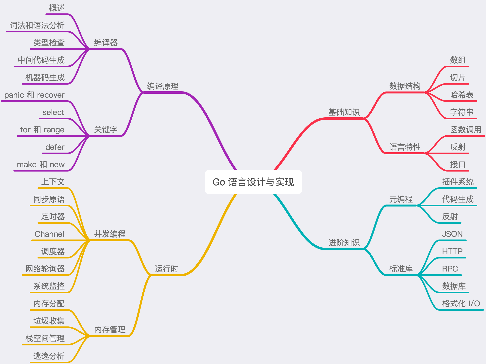

## 编译原理

编译器的前端一般承担着词法分析、语法分析、类型检查和中间代码生成几部分工作，而编译器后端主要负责目标代码的生成和优化，也就是将中间代码翻译成目标机器能够运行的二进制机器码。
Go 的编译器在逻辑上可以被分成四个阶段：词法与语法分析、类型检查和 AST 转换、通用 SSA（静态单赋值） 生成和最后的机器代码生成。

静态类型检查能够帮助我们在编译期间发现程序中出现的类型错误。
动态类型检查是在运行时确定程序类型安全的过程，它需要编程语言在编译时为所有的对象加入类型标签等信息，运行时可以使用这些存储的类型信息来实现动态派发、向下转型、反射以及其他特性
Java 不仅在编译期间提前检查类型发现类型错误，还为对象添加了类型信息，在运行时使用反射根据对象的类型动态地执行方法增强灵活性并减少冗余代码。Go 语言的编译器不仅使用静态类型检查来保证程序运行的类型安全，还会在编程期间引入类型信息，让工程师能够使用反射来判断参数和变量的类型。

类型检查是 Go 语言编译的第二个阶段，在词法和语法分析之后我们得到了每个文件对应的抽象语法树，随后的类型检查会遍历抽象语法树中的节点，对每个节点的类型进行检验，找出其中存在的语法错误，在这个过程中也可能会对抽象语法树进行改写，这不仅能够去除一些不会被执行的代码、对代码进行优化以提高执行效率，而且也会修改 make、new 等关键字对应节点的操作类型。

make 和 new 这些内置函数其实并不会直接对应某些函数的实现，它们会在编译期间被转换成真正存在的其他函数

中间代码是编译器或者虚拟机使用的语言，它可以来帮助我们分析计算机程序。在编译过程中，编译器会在将源代码转换到机器码的过程中，先把源代码转换成一种中间的表示形式，即中间代码。
中间代码的生成过程是从 AST 抽象语法树到 SSA 中间代码的转换过程，在这期间会对语法树中的关键字再进行改写，改写后的语法树会经过多轮处理转变成最后的 SSA 中间代码，相关代码中包括了大量 switch 语句、复杂的函数和调用栈，阅读和分析起来也非常困难。

很多 Go 语言中的关键字和内置函数都是在这个阶段被转换成运行时包中方法的。

在不考虑逃逸分析的情况下，如果数组中元素的个数小于或者等于 4 个，那么所有的变量会直接在栈上初始化，如果数组元素大于 4 个，变量就会在静态存储区初始化然后拷贝到栈上，这些转换后的代码才会继续进入中间代码生成和机器码生成两个阶段，最后生成可以执行的二进制文件。
通过对其实现的分析，我们知道了对数组的访问和赋值需要同时依赖编译器和运行时，它的大多数操作在编译期间都会转换成直接读写内存，在中间代码生成期间，编译器还会插入运行时方法 runtime.panicIndex 调用防止发生越界错误。

Go 通过栈传递函数的参数和返回值，在调用函数之前会在栈上为返回值分配合适的内存空间，随后将入参从右到左按顺序压栈并拷贝参数，返回值会被存储到调用方预留好的栈空间上，我们可以简单总结出以下几条规则：

通过堆栈传递参数，入栈的顺序是从右到左，而参数的计算是从左到右；
函数返回值通过堆栈传递并由调用者预先分配内存空间；
调用函数时都是传值，接收方会对入参进行复制再计算；

当我们使用指针实现接口时，只有指针类型的变量才会实现该接口；当我们使用结构体实现接口时，指针类型和结构体类型都会实现该接口。当然这并不意味着我们应该一律使用结构体实现接口，这个问题在实际工程中也没那么重要，在这里我们只想解释现象背后的原因。
使用不同类型实现接口带来的差异、函数调用时发生的隐式类型转换；接口的类型转换、类型断言以及动态派发机制？

make 关键字的作用是创建切片、哈希表和 Channel 等内置的数据结构，而 new 的作用是为类型申请一片内存空间，并返回指向这片内存的指针。
内存GC，GMP，channel那几段

