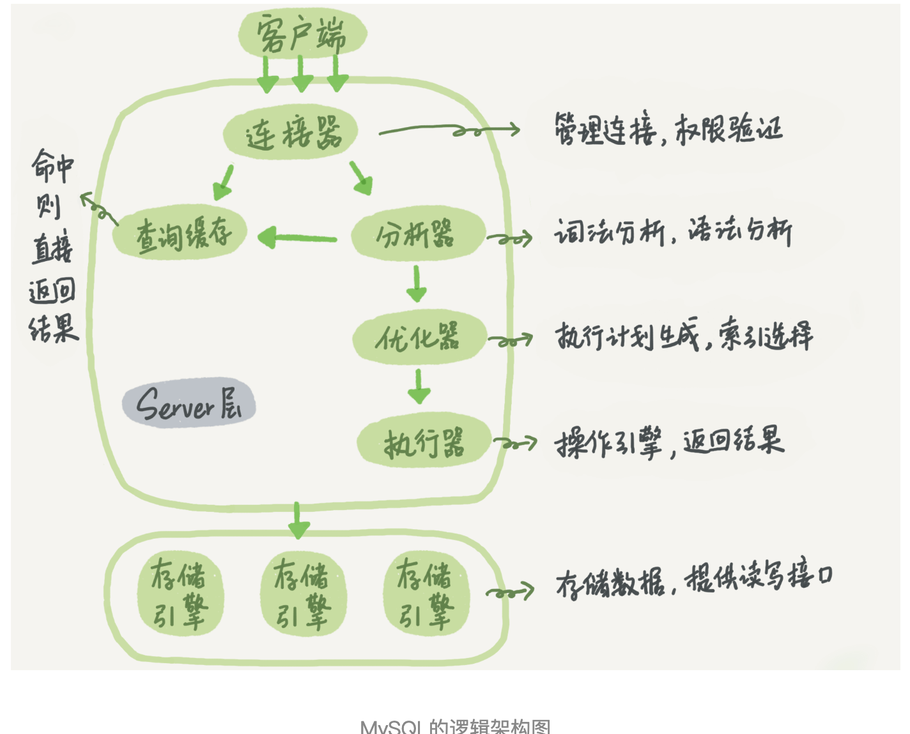

##  第一讲SQL语句怎么执行
>连接器
（词法）分析器
优化器
执行器

------------------------------------

>数据库的慢查询日志中看到一个rows_examined的字段，表示这个语句执行过程中扫描了多少行。这个值就是在执行器每次调用引擎获取数据行的时候累加的。
>在有些场景下，执行器调用一次，在引擎内部则扫描了多行，因此引擎扫描行数跟rows_examined并不是完全相同的。

每天3讲

##  第二讲SQL语句怎么更新
### 重要的日志模块：redo log
>MySQL里经常说到的WAL技术，WAL的全称是Write-Ahead Logging，它的关键点就是先写日志，再写磁盘，也就是先写粉板，等不忙的时候再写账本。
>当有一条记录需要更新的时候，InnoDB引擎就会先把记录写到redo log（粉板）里面，并更新内存，这个时候更新就算完成了。
>同时，InnoDB引擎会在适当的时候，将这个操作记录更新到磁盘里面，而这个更新往往是在系统比较空闲的时候做

### 重要的日志模块：binlog
>MySQL整体来看，其实就有两块：一块是Server层，它主要做的是MySQL功能层面的事情；还有一块是引擎层，负责存储相关的具体事宜。上面我们聊到的粉板redo log是InnoDB引擎特有的日志，而Server层也有自己的日志，称为binlog（归档日志）
### 两阶段提交
>将redo log的写入拆成了两个步骤：prepare和commit，这就是"两阶段提交"。

##  第三讲事务隔离
>SQL标准的事务隔离级别包括：读未提交（read uncommitted）、读提交（read committed）、可重复读（repeatable read）和串行化（serializable ）。下面我逐一为你解释：
 
>读未提交是指，一个事务还没提交时，它做的变更就能被别的事务看到。
 读提交是指，一个事务提交之后，它做的变更才会被其他事务看到。
 可重复读是指，一个事务执行过程中看到的数据，总是跟这个事务在启动时看到的数据是一致的。当然在可重复读隔离级别下，未提交变更对其他事务也是不可见的。
 串行化，顾名思义是对于同一行记录，“写”会加“写锁”，“读”会加“读锁”。当出现读写锁冲突的时候，后访问的事务必须等前一个事务执行完成，才能继续执行。

##  第四讲索引（上）
### 索引的常见模型
>哈希表: 适用于只有等值查询的场景，比如Memcached及其他一些NoSQL引擎
>有序数组：只适用于静态存储引擎，在等值查询和范围查询场景中的性能就都非常优秀
>搜索树

### InnoDB 的索引模型
> InnoDB使用了B+树索引模型，所以数据都是存储在B+树中的
>主键索引的叶子节点存的是整行数据。在InnoDB里，主键索引也被称为聚簇索引（clustered index）。
 非主键索引的叶子节点内容是主键的值。在InnoDB里，非主键索引也被称为二级索引（secondary index）。
>B+树能够很好地配合磁盘的读写特性，减少单次查询的磁盘访问次数。

>基于主键索引和普通索引的查询有什么区别？
>如果语句是select * from T where ID=500，即主键查询方式，则只需要搜索ID这棵B+树；
 如果语句是select * from T where k=5，即普通索引查询方式，则需要先搜索k索引树，得到ID的值为500，再到ID索引树搜索一次。这个过程称为回表。
 也就是说，基于非主键索引的查询需要多扫描一棵索引树。因此，我们在应用中应该尽量使用主键查询。

>从性能和存储空间方面考量，自增主键往往是更合理的选择。

##  第五讲索引（下）
> B+树，最左前缀原则, 这个最左前缀可以是联合索引的最左N个字段，也可以是字符串索引的最左M个字符
>索引顺序，组合原则

## 06 | 全局锁和表锁
> 全局锁的典型使用场景是，做全库逻辑备份。也就是把整库每个表都select出来存成文本。
> 表锁一般是在数据库引擎不支持行锁的时候才会被用到的。
> MySQL里面表级别的锁有两种：一种是表锁，一种是元数据锁（meta data lock，MDL)。
> 另一类表级的锁是MDL（metadata lock)。在MySQL 5.5版本中引入了MDL，当对一个表做增删改查操作的时候，加MDL读锁；当要对表做结构变更操作的时候，加MDL写锁。
>
>如何安全地给小表加字段？
 
>首先我们要解决长事务，事务不提交，就会一直占着MDL锁。在MySQL的information_schema 库的 innodb_trx 表中，你可以查到当前执行中的事务。如果你要做DDL变更的表刚好有长事务在执行，要考虑先暂停DDL，或者kill掉这个长事务。
 
>但考虑一下这个场景。如果你要变更的表是一个热点表，虽然数据量不大，但是上面的请求很频繁，而你不得不加个字段，你该怎么做呢？
 
>这时候kill可能未必管用，因为新的请求马上就来了。比较理想的机制是，在alter table语句里面设定等待时间，如果在这个指定的等待时间里面能够拿到MDL写锁最好，拿不到也不要阻塞后面的业务语句，先放弃。之后开发人员或者DBA再通过重试命令重复这个过程。

## 07 | 行锁功过
>MySQL的行锁是在引擎层由各个引擎自己实现的。但并不是所有的引擎都支持行锁，比如MyISAM引擎就不支持行锁。不支持行锁意味着并发控制只能使用表锁，对于这种引擎的表，同一张表上任何时刻只能有一个更新在执行，这就会影响到业务并发度。
>InnoDB是支持行锁的，这也是MyISAM被InnoDB替代的重要原因之一。

### 两阶段锁
> 在InnoDB事务中，行锁是在需要的时候才加上的，但并不是不需要了就立刻释放，而是要等到事务结束时才释放。这个就是两阶段锁协议。
> 如果你的事务中需要锁多个行，要把最可能造成锁冲突、最可能影响并发度的锁尽量往后放。

### 死锁和死锁检测
>当出现死锁以后，有两种策略：
>一种策略是，直接进入等待，直到超时。这个超时时间可以通过参数innodb_lock_wait_timeout来设置。
>另一种策略是，发起死锁检测，发现死锁后，主动回滚死锁链条中的某一个事务，让其他事务得以继续执行。将参数innodb_deadlock_detect设置为on，表示开启这个逻辑。

> 所以，正常情况下我们还是要采用第二种策略，即：主动死锁检测，而且innodb_deadlock_detect的默认值本身就是on。
> 主动死锁检测在发生死锁的时候，是能够快速发现并进行处理的，但是它也是有额外负担的。

####怎么解决由这种热点行更新导致的性能问题呢？
>问题的症结在于，死锁检测要耗费大量的CPU资源。
  一种头痛医头的方法，就是如果你能确保这个业务一定不会出现死锁，可以临时把死锁检测关掉。但是这种操作本身带有一定的风险，因为业务设计的时候一般不会把死锁当做一个严重错误，毕竟出现死锁了，就回滚，然后通过业务重试一般就没问题了，这是业务无损的。而关掉死锁检测意味着可能会出现大量的超时，这是业务有损的。
  另一个思路是控制并发度。根据上面的分析，你会发现如果并发能够控制住，比如同一行同时最多只有10个线程在更新，那么死锁检测的成本很低，就不会出现这个问题。一个直接的想法就是，在客户端做并发控制。但是，你会很快发现这个方法不太可行，因为客户端很多。我见过一个应用，有600个客户端，这样即使每个客户端控制到只有5个并发线程，汇总到数据库服务端以后，峰值并发数也可能要达到3000。
  因此，这个并发控制要做在数据库服务端。如果你有中间件，可以考虑在中间件实现；如果你的团队有能修改MySQL源码的人，也可以做在MySQL里面。基本思路就是，对于相同行的更新，在进入引擎之前排队。这样在InnoDB内部就不会有大量的死锁检测工作了。
  可能你会问，如果团队里暂时没有数据库方面的专家，不能实现这样的方案，能不能从设计上优化这个问题呢？
  你可以考虑通过将一行改成逻辑上的多行来减少锁冲突。还是以影院账户为例，可以考虑放在多条记录上，比如10个记录，影院的账户总额等于这10个记录的值的总和。这样每次要给影院账户加金额的时候，随机选其中一条记录来加。这样每次冲突概率变成原来的1/10，可以减少锁等待个数，也就减少了死锁检测的CPU消耗。
  这个方案看上去是无损的，但其实这类方案需要根据业务逻辑做详细设计。如果账户余额可能会减少，比如退票逻辑，那么这时候就需要考虑当一部分行记录变成0的时候，代码要有特殊处理。

## 08 | 事务到底是隔离的还是不隔离的
> 数据版本快照，row trx_id
> 更新数据都是先读后写的，而这个读，只能读当前的值，称为“当前读”（current read）。
>在可重复读隔离级别下，只需要在事务开始的时候创建一致性视图，之后事务里的其他查询都共用这个一致性视图；
 在读提交隔离级别下，每一个语句执行前都会重新算出一个新的视图。
>对于可重复读，查询只承认在事务启动前就已经提交完成的数据；
 对于读提交，查询只承认在语句启动前就已经提交完成的数据；

## 09 | 普通索引和唯一索引 ??
>使用change buffer对更新过程的加速作用，也清楚了change buffer只限于用在普通索引的场景下，而不适用于唯一索引。那么，现在有一个问题就是：普通索引的所有场景，使用change buffer都可以起到加速作用吗？
>因为merge的时候是真正进行数据更新的时刻，而change buffer的主要目的就是将记录的变更动作缓存下来，所以在一个数据页做merge之前，change buffer记录的变更越多（也就是这个页面上要更新的次数越多），收益就越大。
>因此，对于写多读少的业务来说，页面在写完以后马上被访问到的概率比较小，此时change buffer的使用效果最好。这种业务模型常见的就是账单类、日志类的系统。

>change buffer使用场景，从普通索引和唯一索引的选择开始，和你分享了数据的查询和更新过程，然后说明了change buffer的机制以及应用场景，最后讲到了索引选择的实践

## 10 | MySQL为什么有时候会选错索引？

## 11 | 怎么给字符串字段加索引？
>也就是说使用前缀索引，定义好长度，就可以做到既节省空间，又不用额外增加太多的查询成本。

>直接创建完整索引，这样可能比较占用空间；

>创建前缀索引，节省空间，但会增加查询扫描次数，并且不能使用覆盖索引；

>倒序存储，再创建前缀索引，用于绕过字符串本身前缀的区分度不够的问题；

>创建hash字段索引，查询性能稳定，有额外的存储和计算消耗，跟第三种方式一样，都不支持范围扫描。

