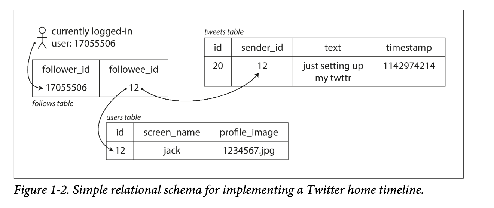
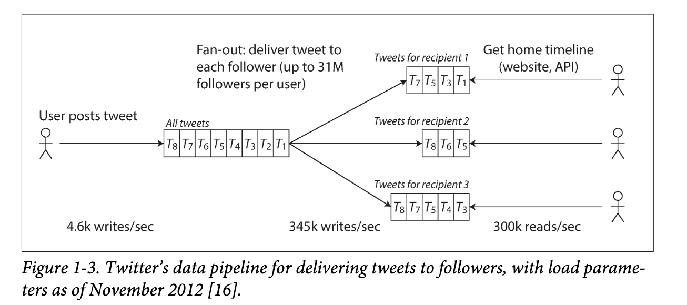

# Chapter 1 Reliable, Scalable, and Maintainable Applications
> introduces  the  terminology  and  approach  that  we’re  going  to  use
throughout this book. It examines what we actually mean by words like reliability, scalability, and maintainability, and how we can try to achieve these goals

that  the  cache  will  be  correctly  invalidated  or  updated  on  writes  so  that  outside  clients  see  consistent  results.  
How  do you  ensure  that  the  data  remains  correct  and  complete,  even  when  things  go  wrong internally? How do you provide consistently good performance to clients, even when parts of your system are degraded? How do you scale to handle an increase in load? What does a good API for the service look like?

There are many factors that may influence the design of a data system, including the skills  and  experience  of  the  people  involved,  legacy  system  dependencies,  the  time‐scale  for  delivery,  your  organization’s  tolerance  of  different  kinds  of  risk,  regulatory constraints, etc. 

## Reliability
The system should continue to work correctly (performing the correct function at the desired level of performance) even in the face of adversity (hardware or software faults, and even human error). 

### Hardware Faults
add  redundancy  to  the  individual  hardware  components in order to reduce the failure rate of the system. Disks may be set up in a RAID configuration,  servers  may  have  dual  power  supplies  and  hot-swappable  CPUs,  and datacenters  may  have  batteries  and  diesel  generators  for  backup  power.  When one component dies, the redundant component can take its place while the broken component  is  replaced.

### Software Errors
There  is  no  quick  solution  to  the  problem  of  systematic  faults  in  software.  Lots  of small  things  can  help:  carefully  thinking  about  assumptions  and  interactions  in  the system;  thorough  testing;  process  isolation;  allowing  processes  to  crash  and  restart;
measuring,  monitoring,  and  analyzing  system  behavior  in  production.  

### Human Errors
1. Design  systems  in  a  way  that  minimizes  opportunities  for  error.
2. Decouple the places where people make the most mistakes from the places where they  can  cause  failures.
3. Test thoroughly at all levels, from unit tests to whole-system integration tests and manual  tests
4. Allow quick and easy recovery from human errors, to minimize the impact in the case of a failure
5. Set  up  detailed  and  clear  monitoring,  such  as  performance  metrics  and  error rates.  In  other  engineering  disciplines  this  is  referred  to  as  telemetry.
6. Implement good management practices and training.

## Scalability
As the system grows (in data volume, traffic volume, or complexity), there should be reasonable ways of dealing with that growth. Scalability  is  the  term  we  use  to  describe  a  system’s  ability  to  cope  with  increased
load. It means considering questions like “If the system grows in a particular way, what are our options for coping with the growth?” and “How can we add computing resources to handle the additional load?

### Describing Load
It  may  be  requests  per  second  to  a  web server, the ratio of reads to writes in a database, the number of simultaneously active
users in a chat room, the hit rate on a cache, or something else. Perhaps the average case  is  what  matters  for  you,  or  perhaps  your  bottleneck  is  dominated  by  a  small number of extreme cases.

#### example case: tweet user's home timeline

approach 1, SQL query: Posting  a  tweet  simply  inserts  the  new  tweet  into  a  global  collection  of  tweets.  

approach 2, Cache timeline when write: Maintain  a  cache  for  each  user’s  home  timeline—like  a  mailbox  of  tweets  for each  recipient  user.  

approach 3, hybrid: combine 1 and 2, approach 2 for normal user with few followees, approach 2 for celebrity/hot users.

### Describing Performance
• When you increase a load parameter and keep the system resources (CPU, memory, network bandwidth, etc.) unchanged, how is the performance of your system
affected?  
• When  you  increase  a  load  parameter,  how  much  do  you  need  to  increase  the resources if you want to keep performance unchanged?

In a batch processing system such as Hadoop, we usually care about throughput.  
In online systems, what’s usually more important is the service’s  response  time.  

#### Latency  and  response  time
Latency  and  response  time  are  often  used  synonymously,  but  they
are not the same. The response time is what the client sees: besides
the actual time to process the request (the service time), it includes
network delays and queueing delays. Latency is the duration that a
request  is  waiting  to  be  handled—during  which  it  is  latent,  await‐
ing service.

Response time variation reasons: random  additional latency could be introduced by a context switch to a background process, the loss of a
network  packet  and  TCP  retransmission,  a  garbage  collection  pause,  a  page  fault
forcing a read from disk, mechanical vibrations in the server rack, or many other
causes.

## Maintainability
Over time, many different people will work on the system (engineering and oper‐
ations,  both  maintaining  current  behavior  and  adapting  the  system  to  new  use
cases), and they should all be able to work on it productively.