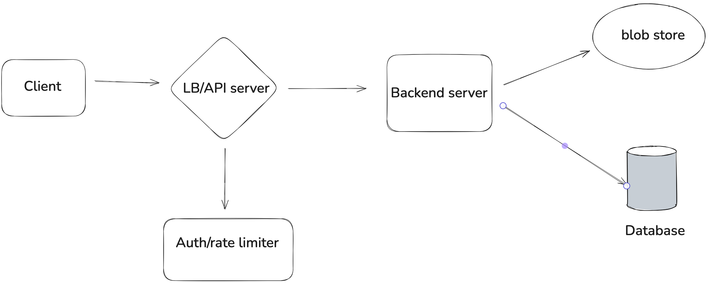

System Design第一步考虑什么? 澄清需求。

Problem: design instagram
- user can follow other users
- user can upload photos
- user can see a list of photos posted by people they follow
- user can see a list of photos posted by themselves

## Clarifications 不要超过五分钟，提一两个，讨论结束了可以延伸
- # users
- 不加额外的requirement,只问最要紧的问题，剩下的加一句话，I have more questions, but we'll gonna that question later, when we have high level design or deep design, I think these are the most important question right now and we can start design
- 第一重要，问用户规模，后面根据常识，展现思考，产品思维，全部自己补全，1B-> let's assume DAU 100M(10%)
- assumptions:
- - each user posts 1 photo per day
- - each user reads feed 20 times per day, so the system is read heavy

- latency? 最重要，不要直接问，提自己的观点，
- - 1s. I think we should target 1 second latency in the beginning. We can adjust the requirement later. For example,We can discuss that tradeoff between 1 second and 100 millionsecond.
- - 面试结束的时候加一句 1second vs. 100 millionsecond tradeoff, 怎么改进支持。

- - non-functional requirements, high scalable? high available? consistency? 这里先不问，或者一笔带过，有了系统之后再说

- avg size of photo: 5MB

## 先确定Data Model, High Level Design？符合思维方式
- API design， input, output, 反推data model, table, workflow，扔掉，最不重要，除非是专门API design的
自己先来一个完整的问面试官可以吗？不要做一步问一步，

- Data Model或者High Level Design二选一
- - 这里用data modeling, 上来一句话总结为什么用数据库
- 数据库设计， DB tables
- - user table primary key: user_id
- - user_follower table primary key: user_id, followee_id (list of followee_ids), follower存一行，还是每一个follower单独存，提一个小的tradeoff
- - 重中之重，photo table primary key: photo_id, upload_user_id, photo_url(提为什么不是文件而是链接，再回去clarify photo size，L5就说照片不存数据库，L6照片5M在用户量不多的情况下可以存数据库，有一个好处就是不需要blob store，简化系统，数据库存照片会有什么问题？第一，数据库存储比blob store存储贵，贵好几倍，规模上去之后成本很大。第二，数据库在存了很多大的数据以后，索引查询都会受影响。行之间locality都会受影响.), blob store to store actual photos.

## 画High level Architecture，一两分钟
画auth/ratelimiter, 弱L6信号

过一下这个系统的read path, write path, 过的时候保证把所有functional requirements都涵盖，double check是不是真的完成了面试官的要求。每个功能在系统里走一遍，大概说一下。

## 展开Database
SQL，NoSQL
qps estimation, write/read qps，都很高用NoSQL DB(L5),(L6) 可以用RDB，写入的时候有问题吗？我们用多个Replica, sharding。读有问题，我们加cache，但是我们会有更大的成本，从这个层面考虑，我们更倾向于NoSQL，项目初期只有RDB，我们可以考虑用RDB。

选熟悉的方向，dive deep，sharding的时候要先估算容量，100 single replica, 核心是photo表的sharding， by user_id（会有hotspot的问题）还是photo_id（fan out会有问题，不好找某个用户的所有photo），怎么解决这些问题。最后总结在现实生活中我们需要做数据分析，make data driven decision, 分析heavy user的比例，它们的photo比一般多多少。估算一下，按user_id来shard，hotspot的distribution概率是多少。

## server的workload isolation问题
- database query workload, 简单查询和数据size小，latency在50ms，机器种类是需要一定的CPU, memory，普通机器就可以
- photo upload/download workload，传输大量的blob data, 带宽要好，内存要求高，
- 倾向于把它们部署成两个service，现实生活中photo upload/download和管理database server的组往往是分开的，把这两个组的backend server放在一起，会导致职责划分不清，在debug和operation, binary release时对这两个组都是不利的。

## pull vs. push
- push更高效，但会引入新的系统，需要告诉client连到哪个server，需要websocket通信，不能用简单的tcp了，新的系统带来新的复杂度，operate maintainance cost是否值得，需要evaluate。L6信号
- fan out on read（读取的时候做聚合排序） vs fan out on write(upload的时候push 给follower，读内存即可), 两种方式结合（L6信号），热点用户on read,一般用户on write，根据data analysis, 算出来热点用户比例threshold。

## read 加速
照片用CDN（引出CDN，而不是直接画出来L6），数据库内存cache，技术要在合适的背景下引入设计，而不是直接给出

找到问题，分析问题，给出方案对比tradeoff，

怎么组织deep dive环节？
problem driving，
我们要怎么解决latency问题？ 怎么提升throughput? 
解决重点问题，收益权衡，2/8原则

如果问出的问题，面试官会用你说呢回答就不要问，换一种方式，比如说我觉得应该是这样的，你觉得怎么样？

Participated in the core back-end development of the Web3 project "Love-in-Cyber" to ensure safe and efficient data processing and interaction, and provided technical support and solutions for the successful advancement of the project to the second stage, overcoming the difficulties in Web3 development technical challenges.Participated in the core back-end development of the Web3 project "Love-in-Cyber" to ensure safe and efficient data processing and interaction, and provided technical support and solutions for the successful advancement of the project to the second stage, overcoming the difficulties in Web3 development technical challenges.
Skills: Web3 · React.js · Blockchain · Rust (Programming Language) · Non-Fungible Tokens (NFTs)

